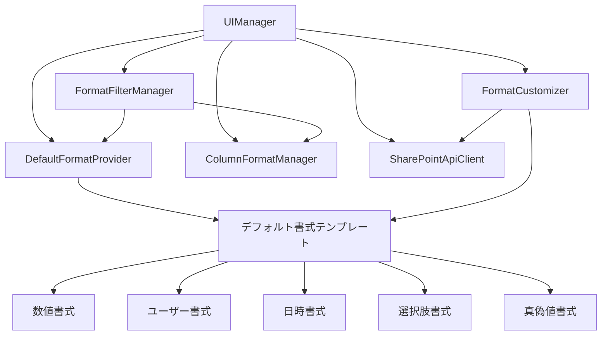

# 設計書

## 概要

Microsoft Lists Column Formatトに、デフォルト書式テンプレートとタイプベースフィルタリング機能を追加します。この設計では、既存のアーキテクチャを拡張し、新しいクラスとUIコンポーネントを追加して、ユーザーが列タイプに適したデフォルト書式を簡単に見つけて適用できるようにします。

## アーキテクチャ

### 既存アーキテクチャの拡張

現在のブックマークレットは以下の主要クラスで構成されています：
- `ColumnFormatManager`: 書式の保存・管理
- `SharePointApiClient`: SharePoint API との通信
- `UIManager`: ユーザーインターフェース管理

新機能のために以下のクラスを追加します：
- `DefaultFormatProvider`: デフォルト書式テンプレートの管理
- `FormatFilterManager`: 書式のフィルタリング機能
- `FormatCustomizer`: 書式の自動カスタマイズ機能

### システム構成図



## コンポーネントと インターフェース

### DefaultFormatProvider クラス

デフォルト書式テンプレートの管理を担当します。

```javascript
class DefaultFormatProvider {
  constructor() {
    this.defaultFormats = this.loadDefaultFormats();
  }

  // 列タイプに基づいてデフォルト書式を取得
  getDefaultFormatsForType(columnType) { }

  // すべてのデフォルト書式を取得
  getAllDefaultFormats() { }

  // デフォルト書式の検証
  validateDefaultFormat(format) { }

  // 列タイプに対応するサンプルデータを生成
  generateSampleDataForType(columnType) { }
}
```

### FormatFilterManager クラス

書式のフィルタリング機能を提供します。

```javascript
class FormatFilterManager {
  constructor(formatManager, defaultFormatProvider) {
    this.formatManager = formatManager;
    this.defaultFormatProvider = defaultFormatProvider;
    this.currentFilter = 'all';
  }

  // フィルターを適用
  applyFilter(filterType) { }

  // フィルタリングされた書式を取得
  getFilteredFormats() { }

  // 利用可能なフィルタータイプを取得
  getAvailableFilterTypes() { }

  // 互換性チェック
  checkCompatibility(format, targetColumnType) { }
}
```

### FormatCustomizer クラス

書式の自動カスタマイズを担当します。

```javascript
class FormatCustomizer {
  constructor(apiClient) {
    this.apiClient = apiClient;
  }

  // 書式を対象列に合わせてカスタマイズ
  customizeFormatForColumn(formatJson, targetColumn) { }

  // フィールド参照を置換
  replaceFieldReferences(formatJson, targetFieldName) { }

  // 複数値フィールド対応
  addMultiValueSupport(formatJson, targetColumn) { }

  // プロパティ参照の検証と修正
  validateAndFixPropertyReferences(formatJson, targetColumn) { }
}
```

### UI コンポーネントの拡張

既存の `UIManager` クラスに以下のメソッドを追加します：

```javascript
// 書式選択ビューの拡張
showFormatSelectionView(targetColumn) {
  // タイプフィルター UI
  // デフォルト書式セクション
  // 保存済み書式セクション
  // 互換性インジケーター
}

// フィルター UI の生成
generateFilterUI() { }

// デフォルト書式カードの生成
generateDefaultFormatCard(format, targetColumn) { }

// 互換性インジケーターの生成
generateCompatibilityIndicator(compatibility) { }
```

## データモデル

### デフォルト書式テンプレート構造

```javascript
const DefaultFormatTemplate = {
  id: 'string',           // 一意識別子
  name: 'string',         // 表示名
  description: 'string',  // 説明
  category: 'string',     // カテゴリ（例：'visual', 'functional'）
  targetTypes: ['string'], // 対象列タイプの配列
  formatJson: {},         // 書式JSON
  previewData: {},        // プレビュー用サンプルデータ
  metadata: {
    author: 'string',     // 作成者
    version: 'string',    // バージョン
    tags: ['string'],     // タグ
    difficulty: 'string'  // 難易度（'basic', 'intermediate', 'advanced'）
  }
};
```

### 互換性情報構造

```javascript
const CompatibilityInfo = {
  level: 'string',        // 'compatible', 'warning', 'incompatible'
  score: 'number',        // 0-100の互換性スコア
  issues: ['string'],     // 問題点の配列
  suggestions: ['string'], // 改善提案の配列
  autoFixAvailable: 'boolean' // 自動修正可能かどうか
};
```

## デフォルト書式テンプレート定義

### 数値列用テンプレート

#### 1. パーセンテージベース色分け
```javascript
{
  id: 'number-percentage-color',
  name: 'パーセンテージ色分け',
  description: '値に応じて背景色を変更（0-100%）',
  targetTypes: ['Number', 'Currency'],
  formatJson: {
    "elmType": "div",
    "style": {
      "background-color": "=if([$FieldName] >= 80, '#107c10', if([$FieldName] >= 60, '#ffaa44', if([$FieldName] >= 40, '#ff8c00', '#d13438')))",
      "color": "white",
      "padding": "4px 8px",
      "border-radius": "4px",
      "text-align": "center",
      "font-weight": "bold"
    },
    "txtContent": "=[$FieldName] + '%'"
  }
}
```

#### 2. 数値バー表示
```javascript
{
  id: 'number-progress-bar',
  name: '進捗バー',
  description: '数値を視覚的なバーで表示',
  targetTypes: ['Number', 'Currency'],
  formatJson: {
    "elmType": "div",
    "style": {
      "display": "flex",
      "align-items": "center",
      "gap": "8px"
    },
    "children": [
      {
        "elmType": "div",
        "style": {
          "background-color": "#f3f2f1",
          "border-radius": "10px",
          "height": "8px",
          "width": "100px",
          "position": "relative"
        },
        "children": [
          {
            "elmType": "div",
            "style": {
              "background-color": "#0078d4",
              "height": "100%",
              "border-radius": "10px",
              "width": "=[$FieldName] + '%'"
            }
          }
        ]
      },
      {
        "elmType": "span",
        "txtContent": "[$FieldName]"
      }
    ]
  }
}
```

### ユーザー列用テンプレート

#### 1. ユーザー画像＋名前
```javascript
{
  id: 'person-image-name',
  name: 'ユーザー画像＋名前',
  description: 'ユーザーの画像と名前を横並びで表示',
  targetTypes: ['User', 'UserMulti'],
  formatJson: {
    "elmType": "div",
    "style": {
      "display": "flex",
      "align-items": "center",
      "gap": "8px"
    },
    "children": [
      {
        "elmType": "img",
        "attributes": {
          "src": "=[$FieldName.picture]",
          "alt": "=[$FieldName.title]"
        },
        "style": {
          "width": "24px",
          "height": "24px",
          "border-radius": "50%",
          "object-fit": "cover"
        }
      },
      {
        "elmType": "span",
        "txtContent": "[$FieldName.title]"
      }
    ]
  }
}
```

#### 2. ユーザーカード
```javascript
{
  id: 'person-card',
  name: 'ユーザーカード',
  description: 'ユーザー情報をカード形式で表示',
  targetTypes: ['User'],
  formatJson: {
    "elmType": "div",
    "style": {
      "border": "1px solid #edebe9",
      "border-radius": "4px",
      "padding": "8px",
      "background-color": "#f8f9fa",
      "display": "flex",
      "align-items": "center",
      "gap": "8px",
      "max-width": "200px"
    },
    "children": [
      {
        "elmType": "img",
        "attributes": {
          "src": "=[$FieldName.picture]"
        },
        "style": {
          "width": "32px",
          "height": "32px",
          "border-radius": "50%"
        }
      },
      {
        "elmType": "div",
        "children": [
          {
            "elmType": "div",
            "style": {
              "font-weight": "600",
              "font-size": "14px"
            },
            "txtContent": "[$FieldName.title]"
          },
          {
            "elmType": "div",
            "style": {
              "font-size": "12px",
              "color": "#605e5c"
            },
            "txtContent": "[$FieldName.email]"
          }
        ]
      }
    ]
  }
}
```

### 日時列用テンプレート

#### 1. 相対時間表示
```javascript
{
  id: 'datetime-relative',
  name: '相対時間',
  description: '現在時刻からの相対時間を表示',
  targetTypes: ['DateTime'],
  formatJson: {
    "elmType": "span",
    "txtContent": "=toLocaleDateString([$FieldName]) + ' (' + toRelativeTime([$FieldName]) + ')'"
  }
}
```

#### 2. 日付アイコン付き
```javascript
{
  id: 'datetime-with-icon',
  name: '日付アイコン付き',
  description: 'カレンダーアイコンと日付を表示',
  targetTypes: ['DateTime'],
  formatJson: {
    "elmType": "div",
    "style": {
      "display": "flex",
      "align-items": "center",
      "gap": "6px"
    },
    "children": [
      {
        "elmType": "span",
        "style": {
          "font-size": "16px"
        },
        "txtContent": "📅"
      },
      {
        "elmType": "span",
        "txtContent": "=toLocaleDateString([$FieldName])"
      }
    ]
  }
}
```

### 選択肢列用テンプレート

#### 1. カラーピル
```javascript
{
  id: 'choice-color-pill',
  name: 'カラーピル',
  description: '選択肢を色付きピルで表示',
  targetTypes: ['Choice', 'MultiChoice'],
  formatJson: {
    "elmType": "span",
    "style": {
      "background-color": "=if([$FieldName] == '高', '#107c10', if([$FieldName] == '中', '#ffaa44', '#d13438'))",
      "color": "white",
      "padding": "2px 8px",
      "border-radius": "12px",
      "font-size": "12px",
      "font-weight": "600"
    },
    "txtContent": "[$FieldName]"
  }
}
```

#### 2. アイコン付き選択肢
```javascript
{
  id: 'choice-with-icon',
  name: 'アイコン付き選択肢',
  description: '選択肢にアイコンを付けて表示',
  targetTypes: ['Choice'],
  formatJson: {
    "elmType": "div",
    "style": {
      "display": "flex",
      "align-items": "center",
      "gap": "6px"
    },
    "children": [
      {
        "elmType": "span",
        "txtContent": "=if([$FieldName] == '完了', '✅', if([$FieldName] == '進行中', '🔄', '⏸️'))"
      },
      {
        "elmType": "span",
        "txtContent": "[$FieldName]"
      }
    ]
  }
}
```

### はい/いいえ列用テンプレート

#### 1. チェックマーク/バツ印
```javascript
{
  id: 'boolean-check-cross',
  name: 'チェック/バツ',
  description: 'はい/いいえをチェックマークとバツ印で表示',
  targetTypes: ['Boolean'],
  formatJson: {
    "elmType": "span",
    "style": {
      "font-size": "18px",
      "color": "=if([$FieldName], '#107c10', '#d13438')"
    },
    "txtContent": "=if([$FieldName], '✓', '✗')"
  }
}
```

#### 2. ステータスバッジ
```javascript
{
  id: 'boolean-status-badge',
  name: 'ステータスバッジ',
  description: 'はい/いいえをステータスバッジで表示',
  targetTypes: ['Boolean'],
  formatJson: {
    "elmType": "span",
    "style": {
      "background-color": "=if([$FieldName], '#107c10', '#d13438')",
      "color": "white",
      "padding": "2px 8px",
      "border-radius": "4px",
      "font-size": "12px",
      "font-weight": "600"
    },
    "txtContent": "=if([$FieldName], 'はい', 'いいえ')"
  }
}
```

## エラーハンドリング

### デフォルト書式の読み込みエラー
- 無効な書式JSONの場合：ログに記録し、その書式をスキップ
- 必須メタデータが不足している場合：デフォルト値を設定
- 書式の検証に失敗した場合：エラー詳細をコンソールに出力

### 書式カスタマイズエラー
- フィールド参照の置換に失敗した場合：元の書式を保持し、警告を表示
- 複数値対応の追加に失敗した場合：手動編集オプションを提供
- プロパティ検証に失敗した場合：互換性警告を表示

### フィルタリングエラー
- 無効なフィルタータイプが指定された場合：「すべて」フィルターにフォールバック
- フィルタリング処理中のエラー：エラーメッセージを表示し、全書式を表示

## テスト戦略

### 単体テスト
- `DefaultFormatProvider` の各メソッドのテスト
- `FormatFilterManager` のフィルタリングロジックのテスト
- `FormatCustomizer` のカスタマイズ機能のテスト

### 統合テスト
- デフォルト書式の読み込みから表示までの流れ
- フィルタリング機能と書式表示の連携
- 書式カスタマイズと適用の一連の流れ

### ユーザビリティテスト
- デフォルト書式の見つけやすさ
- フィルタリング機能の使いやすさ
- 互換性インジケーターの分かりやすさ

### パフォーマンステスト
- 大量の書式データでのフィルタリング性能
- デフォルト書式の読み込み時間
- UI の応答性

## セキュリティ考慮事項

### XSS 対策
- デフォルト書式のHTMLエスケープ処理
- ユーザー入力のサニタイゼーション
- 動的に生成されるHTMLの検証

### データ検証
- デフォルト書式JSONの構造検証
- メタデータの妥当性チェック
- フィールド参照の安全性確認

## 互換性とマイグレーション

### 既存機能との互換性
- 既存の保存済み書式との完全な互換性を維持
- 既存のUI要素への影響を最小限に抑制
- 既存のAPIインターフェースを変更しない

### 将来の拡張性
- 新しい列タイプへの対応が容易な設計
- カスタムデフォルト書式の追加機能
- 書式テンプレートのインポート/エクスポート機能
