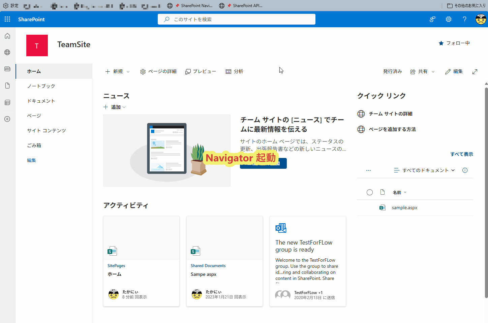

# 🔖 Bookmarklet Gallery

_[日本語](README.md) | [English](README.en.md)_

[](https://github.com/baku2san/bookmarklet-gallery/actions)
[](https://opensource.org/licenses/MIT)

Interactive gallery of useful bookmarklets including SharePoint Navigator, API tools, and other productivity utilities.

## 🌐 Live Demo

**GitHub Pages**: [https://baku2san.github.io/bookmarklet-gallery](https://baku2san.github.io/bookmarklet-gallery)

## 📦 Available Bookmarklets

### 🎯 Productivity Tools

- **🐛 Debug Test** - ブックマークレットのデバッグ・診断ツール
- **🧪 Simple Test** - シンプルなテスト用ブックマークレット
- **📊 Page Analyzer** - ページ構造・メタデータ分析ツール
- **🧭 SharePoint Navigator** - SharePoint サイト内ナビゲーションツール



### 🛠️ Development Tools

- **🎨 CSS Inspector** - CSS 開発・デバッグツール
- **🔌 API Tester** - API エンドポイントのテスト
- **🔗 SharePoint API Navigator** - SharePoint REST API の探索・テストツール


## 🚀 Quick Start

1. **ギャラリーにアクセス**: [GitHub Pages URL]を開く
2. **ブックマークレットを選択**: 使いたいツールをクリック
3. **ブックマークバーにドラッグ**: ブックマークレットをブラウザのブックマークバーにドラッグ
4. **実行**: 任意のページでブックマークレットをクリックして実行

## 🔧 Development

### Prerequisites

- Node.js 18+
- npm
- PowerShell (Windows) / pwsh (Linux/macOS)

### Quick Setup

```bash
# 新規環境セットアップ（推奨）
.\scripts\setup.ps1 -Build

# または従来の方法
cd bookmarklets
npm install
npm run build
```

### Build

```bash
npm run build          # 本番ビルド
npm run dev           # 開発ビルド + 確認
npm run watch         # ファイル監視モード
```

### Local Preview

```bash
npm run build
# bookmarklets/dist/install.html をブラウザで開く
```

## 📁 Project Structure

```tree
bookmarklets/
├── src/
│   ├── development/      # 開発ツール系ブックマークレット
│   ├── productivity/     # 生産性向上ツール系ブックマークレット
│   └── gallery.yml       # ギャラリー設定ファイル
├── dist/
│   ├── install.html      # 本番用ギャラリーページ (自動生成)
│   └── dev.html          # 開発者向けページ (自動生成)
├── build-production.js   # ビルドスクリプト
└── package.json         # Node.js設定

scripts/                  # プロジェクト運用スクリプト
├── setup.ps1            # 新規環境セットアップ
├── diagnose.ps1         # 環境診断・トラブルシューティング
├── update-deps.ps1      # 依存関係管理・セキュリティ監査
└── README.md            # スクリプト使用方法
```

## 🛠️ Maintenance & Troubleshooting

### 🔍 環境診断

```powershell
# 問題の診断
.\scripts\diagnose.ps1

# 詳細な診断情報
.\scripts\diagnose.ps1 -Detailed

# 自動修復を試行
.\scripts\diagnose.ps1 -Fix
```

### 🔒 セキュリティ・依存関係管理

```powershell
# 依存関係チェック
.\scripts\update-deps.ps1 -Check

# セキュリティ監査
.\scripts\update-deps.ps1 -Audit

# 対話式メンテナンス
.\scripts\update-deps.ps1 -All
```

### 🎯 VS Code タスク

`Ctrl+Shift+P` → `Tasks: Run Task` で利用可能：

- **🚀 新規環境セットアップ** - 一括セットアップ
- **🔍 環境診断** - 詳細診断
- **🔧 環境自動修復** - 問題の自動修復
- **🔨 ブックマークレットをビルド** - 本番ビルド
- **👀 開発モード（ウォッチ）** - ファイル監視
- **🔒 セキュリティ監査** - セキュリティチェック

## 🔄 Auto-Deployment

main ブランチへの push/merge 時に自動的に GitHub Pages にデプロイされます。

### Deployment Process

1. 📥 コードをチェックアウト
2. 🟢 Node.js 環境をセットアップ
3. 📦 依存関係をインストール
4. 🔨 ブックマークレットをビルド
5. 📁 GitHub Pages 用コンテンツを準備
6. 🌐 GitHub Pages にデプロイ

## 📚 Documentation

- 📖 [セットアップガイド](./docs/SETUP.md)
- 🌐 [GitHub Pages デプロイ](./docs/GITHUB_PAGES_SETUP.md)
- 🤝 [貢献ガイドライン](./docs/CONTRIBUTING.md)
- 🔧 [スクリプト使用方法](./scripts/README.md)

## 🤝 Contributing

プロジェクトへの貢献を歓迎します！詳細は [貢献ガイドライン](./docs/CONTRIBUTING.md) をご覧ください。

1. Fork this repository
2. Create your feature branch (`git checkout -b feature/amazing-feature`)
3. Commit your changes (`git commit -m 'feat: add amazing feature'`)
4. Push to the branch (`git push origin feature/amazing-feature`)
5. Open a Pull Request

## 📄 License

MIT License - 詳細は [LICENSE](LICENSE) ファイルをご覧ください。

---

**⭐ このリポジトリが役に立ったらスターをお願いします！**
